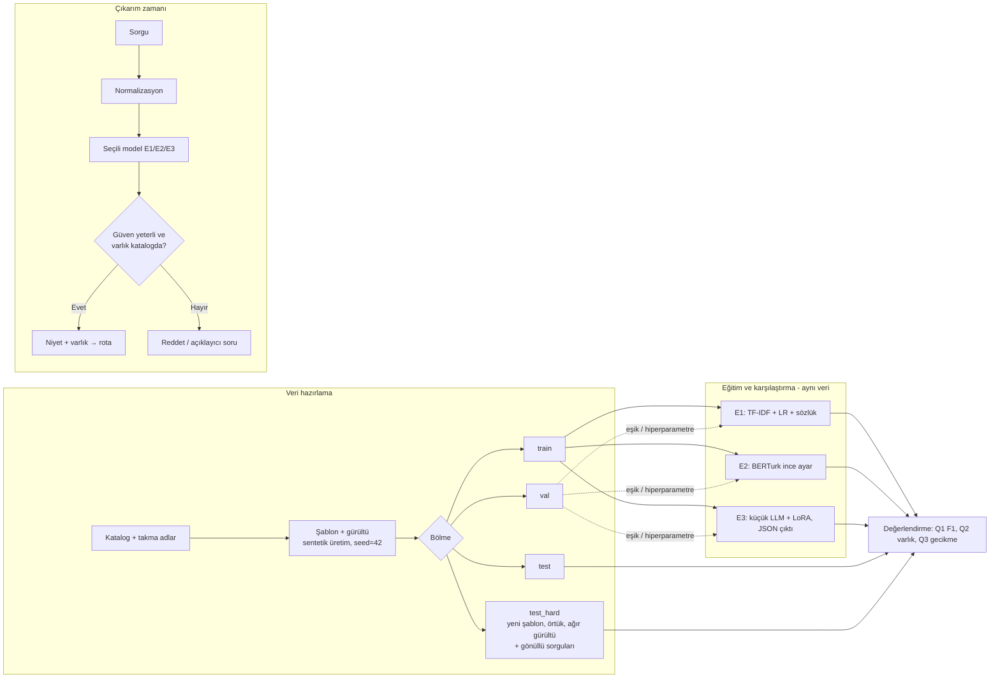

# AI Pipeline Diyagramı

```mermaid
flowchart LR
    subgraph Veri[Veri hazırlama]
        K[Katalog + takma adlar] --> G[Şablon + gürültü<br/>sentetik üretim, seed=42]
        G --> S{Bölme}
        S --> TR[train] & VA[val] & TE[test]
        S --> TH[test_hard<br/>yeni şablon, örtük, ağır gürültü<br/>+ gönüllü sorguları]
    end
    subgraph Egitim[Eğitim ve karşılaştırma - aynı veri]
        TR --> E1[E1: TF-IDF + LR + sözlük]
        TR --> E2[E2: BERTurk ince ayar]
        TR --> E3[E3: küçük LLM + LoRA, JSON çıktı]
        VA -. eşik / hiperparametre .-> E1 & E2 & E3
    end
    subgraph Cikarim[Çıkarım zamanı]
        Q[Sorgu] --> N[Normalizasyon]
        N --> M[Seçili model E1/E2/E3]
        M --> C{Güven yeterli ve<br/>varlık katalogda?}
        C -- Evet --> R[Niyet + varlık → rota]
        C -- Hayır --> X[Reddet / açıklayıcı soru]
    end
    E1 & E2 & E3 --> EV[Değerlendirme: Q1 F1, Q2 varlık, Q3 gecikme]
    TE --> EV
    TH --> EV
```

**Kural:** Eşikler yalnızca `val` üzerinde seçilir; `test` ve `test_hard` model seçiminde kullanılmaz.
