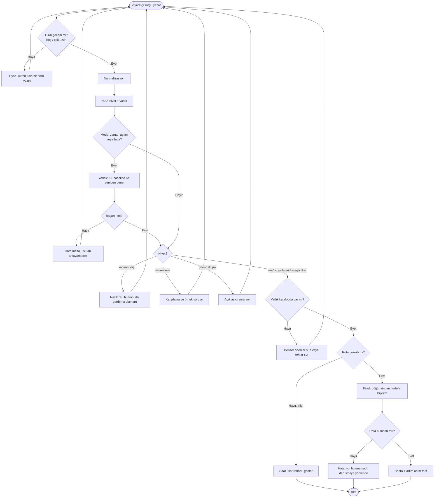
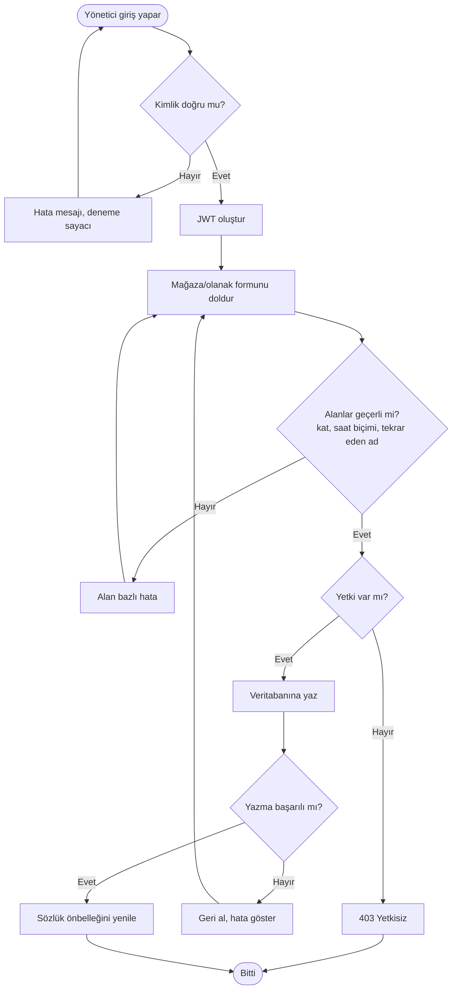
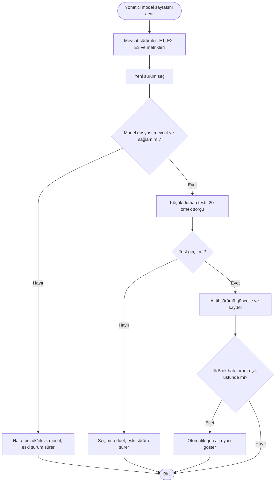

# Akış Diyagramları (hata dallarıyla)

## Akış 1: Ziyaretçi sorgusu → rota

```mermaid
flowchart TD
    A([Ziyaretçi sorgu yazar]) --> B{Girdi geçerli mi?<br/>boş / çok uzun}
    B -- Hayır --> B1[Uyarı: lütfen kısa bir soru yazın] --> A
    B -- Evet --> C[Normalizasyon]
    C --> D[NLU: niyet + varlık]
    D --> E{Model zaman aşımı<br/>veya hata?}
    E -- Evet --> E1[Yedek: E1 baseline ile yeniden dene] --> E2{Başarılı mı?}
    E2 -- Hayır --> E3[Hata mesajı: şu an anlayamadım] --> A
    E2 -- Evet --> F
    E -- Hayır --> F{Niyet?}
    F -- kapsam dışı --> F1[Nazik ret: bu konuda yardımcı olamam] --> A
    F -- selamlama --> F2[Karşılama ve örnek sorular] --> A
    F -- güven düşük --> F3[Açıklayıcı soru sor] --> A
    F -- mağaza/olanak/kategori/kat --> G{Varlık katalogda var mı?}
    G -- Hayır --> G1[Benzer öneriler sun veya tekrar sor] --> A
    G -- Evet --> H{Rota gerekli mi?}
    H -- Hayır, bilgi --> H1[Saat / kat rehberi göster] --> Z([Bitti])
    H -- Evet --> I[Kiosk düğümünden hedefe Dijkstra]
    I --> J{Rota bulundu mu?}
    J -- Hayır --> J1[Hata: yol bulunamadı, danışmaya yönlendir] --> Z
    J -- Evet --> K[Harita + adım adım tarif] --> Z
```

## Akış 2: Yönetici katalog güncelleme

```mermaid
flowchart TD
    A([Yönetici giriş yapar]) --> B{Kimlik doğru mu?}
    B -- Hayır --> B1[Hata mesajı, deneme sayacı] --> A
    B -- Evet --> C[JWT oluştur]
    C --> D[Mağaza/olanak formunu doldur]
    D --> E{Alanlar geçerli mi?<br/>kat, saat biçimi, tekrar eden ad}
    E -- Hayır --> E1[Alan bazlı hata] --> D
    E -- Evet --> F{Yetki var mı?}
    F -- Hayır --> F1[403 Yetkisiz] --> Z([Bitti])
    F -- Evet --> G[Veritabanına yaz]
    G --> H{Yazma başarılı mı?}
    H -- Hayır --> H1[Geri al, hata göster] --> D
    H -- Evet --> I[Sözlük önbelleğini yenile] --> Z
```

## Akış 3: Model sürümü seçme ve geri alma

```mermaid
flowchart TD
    A([Yönetici model sayfasını açar]) --> B[Mevcut sürümler: E1, E2, E3 ve metrikleri]
    B --> C[Yeni sürüm seç]
    C --> D{Model dosyası mevcut ve sağlam mı?}
    D -- Hayır --> D1[Hata: bozuk/eksik model, eski sürüm sürer] --> Z([Bitti])
    D -- Evet --> E[Küçük duman testi: 20 örnek sorgu]
    E --> F{Test geçti mi?}
    F -- Hayır --> F1[Seçimi reddet, eski sürüm sürer] --> Z
    F -- Evet --> G[Aktif sürümü güncelle ve kaydet]
    G --> H{İlk 5 dk hata oranı eşik üstünde mi?}
    H -- Evet --> H1[Otomatik geri al, uyarı göster] --> Z
    H -- Hayır --> Z
```
