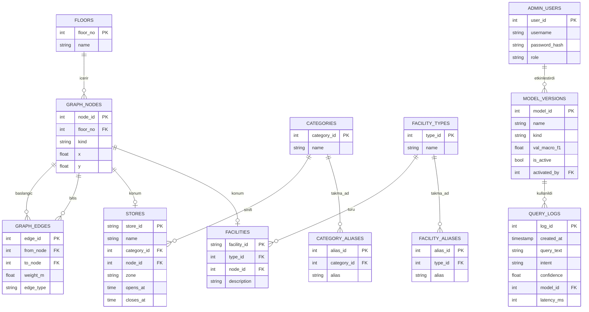

# ER Diyagramı

```mermaid
erDiagram
    FLOORS ||--o{ GRAPH_NODES : icerir
    GRAPH_NODES ||--o{ GRAPH_EDGES : baslangic
    GRAPH_NODES ||--o{ GRAPH_EDGES : bitis
    GRAPH_NODES ||--o| STORES : konum
    GRAPH_NODES ||--o| FACILITIES : konum
    CATEGORIES ||--o{ STORES : sinifi
    CATEGORIES ||--o{ CATEGORY_ALIASES : takma_ad
    FACILITY_TYPES ||--o{ FACILITIES : turu
    FACILITY_TYPES ||--o{ FACILITY_ALIASES : takma_ad
    MODEL_VERSIONS ||--o{ QUERY_LOGS : kullanildi
    ADMIN_USERS ||--o{ MODEL_VERSIONS : etkinlestirdi

    FLOORS { int floor_no PK
             string name }
    GRAPH_NODES { int node_id PK
                  int floor_no FK
                  string kind
                  float x
                  float y }
    GRAPH_EDGES { int edge_id PK
                  int from_node FK
                  int to_node FK
                  float weight_m
                  string edge_type }
    CATEGORIES { int category_id PK
                 string name }
    CATEGORY_ALIASES { int alias_id PK
                       int category_id FK
                       string alias }
    FACILITY_TYPES { int type_id PK
                     string name }
    FACILITY_ALIASES { int alias_id PK
                       int type_id FK
                       string alias }
    STORES { string store_id PK
             string name
             int category_id FK
             int node_id FK
             string zone
             time opens_at
             time closes_at }
    FACILITIES { string facility_id PK
                 int type_id FK
                 int node_id FK
                 string description }
    ADMIN_USERS { int user_id PK
                  string username
                  string password_hash
                  string role }
    MODEL_VERSIONS { int model_id PK
                     string name
                     string kind
                     float val_macro_f1
                     bool is_active
                     int activated_by FK }
    QUERY_LOGS { int log_id PK
                 timestamp created_at
                 string query_text
                 string intent
                 float confidence
                 int model_id FK
                 int latency_ms }
```
